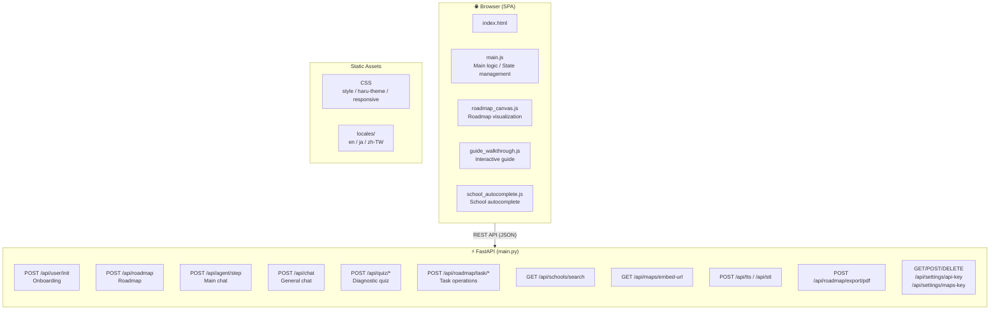
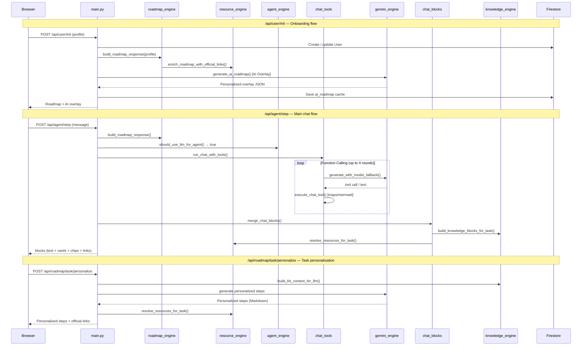
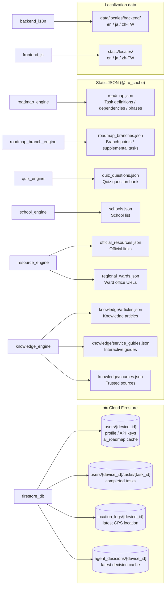
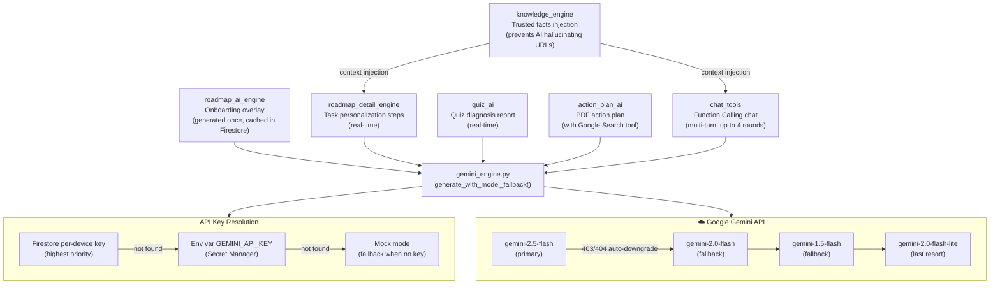
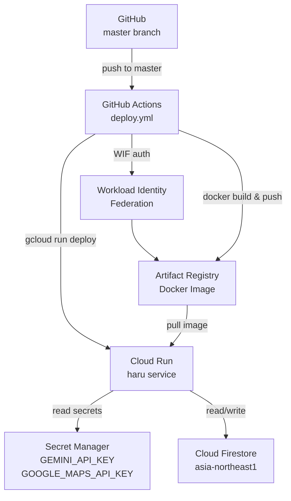

# HARU System Architecture

## Overall Architecture

---

## Backend Module Relationships

```mermaid
graph TB
    subgraph Entry["Entry Layer"]
        MAIN["main.py<br/>FastAPI routing & startup"]
    end

    subgraph Decision["Decision Layer"]
        AGENT["agent_engine.py<br/>Rule-based / LLM routing"]
    end

    subgraph AI["🤖 AI Layer"]
        GEMINI["gemini_engine.py<br/>Gemini API wrapper<br/>Model fallback"]
        ROADMAP_AI["roadmap_ai_engine.py<br/>Onboarding AI overlay generation"]
        DETAIL_AI["roadmap_detail_engine.py<br/>Task personalization prompt"]
        QUIZ_AI["quiz_ai.py<br/>Quiz diagnosis AI"]
        ACTION_AI["action_plan_ai.py<br/>PDF action plan AI"]
        CHAT_TOOLS["chat_tools.py<br/>Gemini Function Calling"]
    end

    subgraph Roadmap["🗺️ Roadmap Layer"]
        ROADMAP["roadmap_engine.py<br/>Core roadmap logic<br/>Task status calculation"]
        BRANCH["roadmap_branch_engine.py<br/>Branch selection & supplemental tasks"]
        DETAIL["roadmap_detail_engine.py<br/>Static task expansion"]
        GRAPH["roadmap_graph_engine.py<br/>Graph / Mermaid data"]
        MERMAID["roadmap_mermaid_engine.py<br/>Mermaid diagram generation"]
        EXPORT["roadmap_export.py<br/>PDF export"]
    end

    subgraph Knowledge["📚 Knowledge Layer"]
        KNOWLEDGE["knowledge_engine.py<br/>Knowledge base queries<br/>Articles / Guides / Sources"]
        RESOURCE["resource_engine.py<br/>Official links DB<br/>Ward office URL resolution"]
    end

    subgraph Support["🔧 Support Layer"]
        QUIZ["quiz_engine.py<br/>Quiz logic"]
        SCHOOL["school_engine.py<br/>School fuzzy search"]
        MAPS["maps_engine.py<br/>Google Maps embed URL"]
        CHAT_BLOCKS["chat_blocks.py<br/>Chat message block assembly"]
        I18N["backend_i18n.py<br/>Backend i18n t()"]
    end

    subgraph Data["💾 Data Layer"]
        FIRESTORE[("Firestore<br/>users / tasks<br/>location_logs / agent_decisions")]
        JSON_DATA["Static JSON data<br/>roadmap / branches / quiz<br/>schools / resources / wards<br/>knowledge articles & guides"]
        FIRESTORE_DB["firestore_db.py<br/>Firestore access layer"]
    end

    MAIN --> AGENT
    MAIN --> ROADMAP
    MAIN --> QUIZ
    MAIN --> SCHOOL
    MAIN --> MAPS
    MAIN --> EXPORT
    AGENT --> CHAT_TOOLS
    CHAT_TOOLS --> GEMINI
    ROADMAP_AI --> GEMINI
    DETAIL_AI --> GEMINI
    QUIZ_AI --> GEMINI
    ACTION_AI --> GEMINI
    ROADMAP --> BRANCH
    ROADMAP --> GRAPH
    ROADMAP --> MERMAID
    DETAIL --> ROADMAP
    DETAIL --> BRANCH
    DETAIL --> DETAIL_AI
    EXPORT --> ACTION_AI
    DETAIL --> KNOWLEDGE
    DETAIL_AI --> KNOWLEDGE
    CHAT_TOOLS --> MAPS
    CHAT_TOOLS --> MERMAID
    CHAT_BLOCKS --> KNOWLEDGE
    CHAT_BLOCKS --> RESOURCE
    ROADMAP --> RESOURCE
    QUIZ --> QUIZ_AI
    MAIN --> CHAT_BLOCKS
    MAIN --> I18N
    FIRESTORE_DB --> FIRESTORE
    MAIN --> FIRESTORE_DB
    ROADMAP --> JSON_DATA
    BRANCH --> JSON_DATA
    KNOWLEDGE --> JSON_DATA
    RESOURCE --> JSON_DATA
    QUIZ --> JSON_DATA
    SCHOOL --> JSON_DATA
```

---

## Key Request Flows

---

## Data Layer

---

## AI Layer and Gemini

---

## Cloud Run Deployment Architecture

