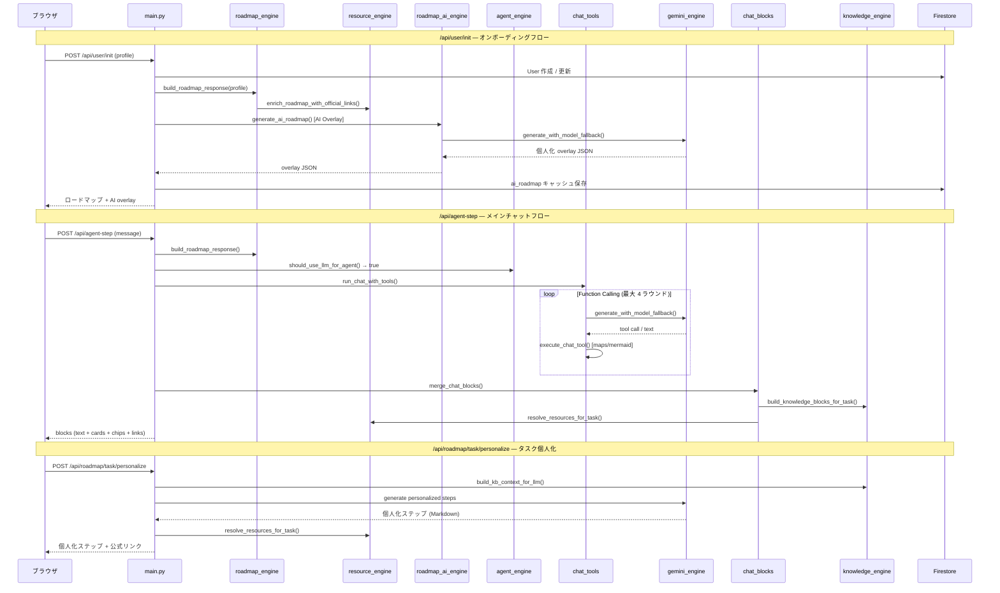
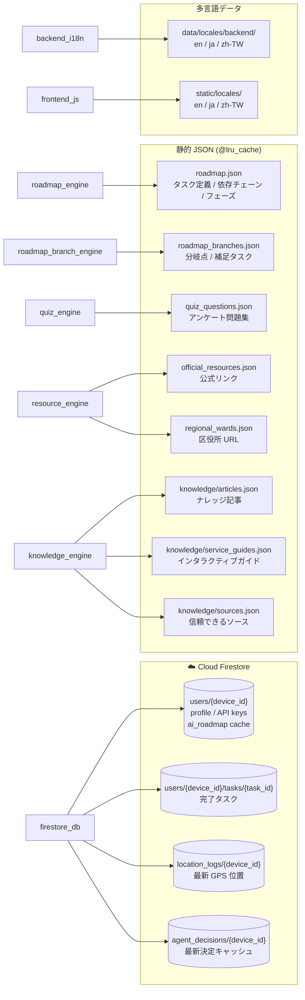
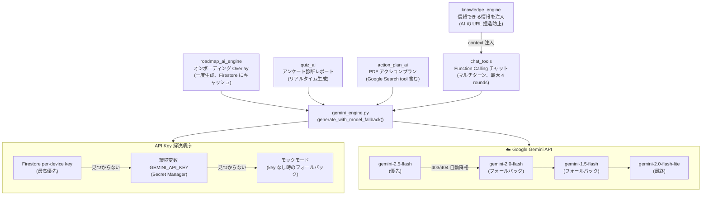
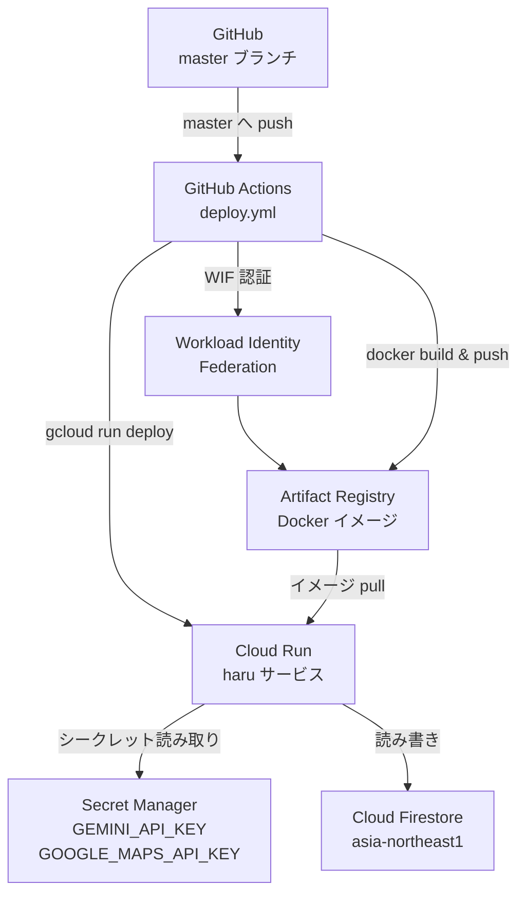

# HARU システム構造図

## 全体アーキテクチャ

```mermaid
graph TB
    subgraph Browser["🌐 ブラウザ (SPA)"]
        HTML["index.html"]
        JS_Main["main.js<br/>メインロジック / 状態管理"]
        JS_Canvas["roadmap_canvas.js<br/>ロードマップ可視化"]
        JS_Guide["guide_walkthrough.js<br/>インタラクティブガイド"]
    end

    subgraph Static["静的リソース"]
        CSS["CSS<br/>style / haru-theme / responsive"]
        I18N_FE["locales/<br/>en / ja / zh-TW"]
    end

    subgraph FastAPI["⚡ FastAPI (main.py)"]
        direction TB
        API_Init["POST /api/user/init<br/>オンボーディング"]
        API_Profile["POST /api/user/profile<br/>プロフィール更新"]
        API_Roadmap["POST /api/roadmap<br/>ロードマップ取得"]
        API_Branch["POST /api/roadmap/branch<br/>分岐選択"]
        API_Agent["POST /api/agent-step<br/>メインチャット"]
        API_AgentLatest["POST /api/agent/latest<br/>最新決定取得"]
        API_Chat["POST /api/chat<br/>汎用チャット"]
        API_AnalyzeForm["POST /api/analyze-form<br/>フォーム OCR 解析"]
        API_Quiz["POST /api/quiz/*<br/>診断アンケート"]
        API_Task["POST /api/roadmap/task/*<br/>タスク操作"]
        API_TaskComplete["POST /api/tasks/complete<br/>完了マーク"]
        API_SyncTasks["POST /api/user/sync_tasks<br/>タスク同期"]
        API_Location["POST /api/user/location<br/>位置情報更新"]
        API_Maps["GET /api/maps/embed-url"]
        API_TTS["POST /api/tts / /api/stt"]
        API_PDF["POST /api/export/roadmap-pdf"]
        API_Knowledge["GET /api/knowledge/for-task<br/>ナレッジ検索"]
        API_Resources["GET /api/resources<br/>公式リソース"]
        API_Suggestions["GET /api/chat/suggestions<br/>おすすめ質問"]
        API_Settings["GET/POST/DELETE<br/>/api/settings/api-key<br/>/api/settings/maps-key"]
    end

    Browser -->|"REST API (JSON)"| FastAPI
```

---

## バックエンドモジュール関係

```mermaid
graph TB
    subgraph Entry["エントリー層"]
        MAIN["main.py<br/>FastAPI ルーティング & 起動"]
    end

    subgraph Decision["決定層"]
        AGENT["agent_engine.py<br/>Rule-based / LLM ルーティング判断"]
    end

    subgraph AI["🤖 AI 層"]
        GEMINI["gemini_engine.py<br/>Gemini API ラッパー<br/>モデルフォールバック"]
        ROADMAP_AI["roadmap_ai_engine.py<br/>オンボーディング AI オーバーレイ生成"]
        QUIZ_AI["quiz_ai.py<br/>アンケート診断レポート AI"]
        ACTION_AI["action_plan_ai.py<br/>PDF アクションプラン AI"]
        CHAT_TOOLS["chat_tools.py<br/>Gemini Function Calling"]
    end

    subgraph Roadmap["🗺️ ロードマップ層"]
        ROADMAP["roadmap_engine.py<br/>ロードマップコアロジック<br/>タスクステータス計算"]
        BRANCH["roadmap_branch_engine.py<br/>分岐選択 & 補足タスク"]
        DETAIL["roadmap_detail_engine.py<br/>タスク静的展開 & プロンプトビルダー"]
        GRAPH["roadmap_graph_engine.py<br/>グラフ / Mermaid データ"]
        MERMAID["roadmap_mermaid_engine.py<br/>Mermaid 図表生成"]
        EXPORT["roadmap_export.py<br/>PDF エクスポート"]
    end

    subgraph Knowledge["📚 ナレッジ層"]
        KNOWLEDGE["knowledge_engine.py<br/>ナレッジベース検索<br/>記事 / ガイド / ソース"]
        RESOURCE["resource_engine.py<br/>公式リンク DB<br/>区役所 URL 動的解決"]
    end

    subgraph Support["🔧 サポート層"]
        QUIZ["quiz_engine.py<br/>診断アンケートロジック"]
        MAPS["maps_engine.py<br/>Google Maps Embed URL"]
        CHAT_BLOCKS["chat_blocks.py<br/>チャットメッセージブロック組み立て"]
        I18N["backend_i18n.py<br/>バックエンド多言語 t()"]
    end

    subgraph Data["💾 データ層"]
        FIRESTORE[("Firestore<br/>users / tasks<br/>location_logs / agent_decisions")]
        JSON_DATA["静的 JSON データ<br/>roadmap / branches / quiz<br/>resources / wards<br/>knowledge articles & guides"]
        FIRESTORE_DB["firestore_db.py<br/>Firestore アクセス層"]
    end

    MAIN --> AGENT
    MAIN --> ROADMAP
    MAIN --> ROADMAP_AI
    MAIN --> QUIZ
    MAIN --> MAPS
    MAIN --> EXPORT
    MAIN --> DETAIL
    MAIN --> RESOURCE
    AGENT --> CHAT_TOOLS
    CHAT_TOOLS --> GEMINI
    ROADMAP_AI --> GEMINI
    QUIZ_AI --> GEMINI
    ACTION_AI --> GEMINI
    ROADMAP --> BRANCH
    ROADMAP --> GRAPH
    DETAIL --> ROADMAP
    DETAIL --> BRANCH
    EXPORT --> ACTION_AI
    DETAIL --> KNOWLEDGE
    CHAT_TOOLS --> MAPS
    CHAT_TOOLS --> MERMAID
    CHAT_BLOCKS --> KNOWLEDGE
    CHAT_BLOCKS --> RESOURCE
    QUIZ --> QUIZ_AI
    MAIN --> CHAT_BLOCKS
    MAIN --> I18N
    FIRESTORE_DB --> FIRESTORE
    MAIN --> FIRESTORE_DB
    ROADMAP --> JSON_DATA
    BRANCH --> JSON_DATA
    KNOWLEDGE --> JSON_DATA
    RESOURCE --> JSON_DATA
    QUIZ --> JSON_DATA
```

---

## 主要リクエストフロー

```mermaid
sequenceDiagram
    participant Browser as ブラウザ
    participant main as main.py
    participant roadmap as roadmap_engine
    participant resource as resource_engine
    participant roadmap_ai as roadmap_ai_engine
    participant agent as agent_engine
    participant chat as chat_tools
    participant gemini as gemini_engine
    participant blocks as chat_blocks
    participant knowledge as knowledge_engine
    participant db as Firestore

    Note over Browser,db: /api/user/init — オンボーディングフロー

    Browser->>main: POST /api/user/init (profile)
    main->>db: User 作成 / 更新
    main->>roadmap: build_roadmap_response(profile)
    roadmap->>resource: enrich_roadmap_with_official_links()
    main->>roadmap_ai: generate_ai_roadmap() [AI Overlay]
    roadmap_ai->>gemini: generate_with_model_fallback()
    gemini-->>roadmap_ai: 個人化 overlay JSON
    roadmap_ai-->>main: overlay JSON
    main->>db: ai_roadmap キャッシュ保存
    main-->>Browser: ロードマップ + AI overlay

    Note over Browser,db: /api/agent-step — メインチャットフロー

    Browser->>main: POST /api/agent-step (message)
    main->>roadmap: build_roadmap_response()
    main->>agent: should_use_llm_for_agent() → true
    main->>chat: run_chat_with_tools()
    loop Function Calling (最大 4 ラウンド)
        chat->>gemini: generate_with_model_fallback()
        gemini-->>chat: tool call / text
        chat->>chat: execute_chat_tool() [maps/mermaid]
    end
    main->>blocks: merge_chat_blocks()
    blocks->>knowledge: build_knowledge_blocks_for_task()
    blocks->>resource: resolve_resources_for_task()
    main-->>Browser: blocks (text + cards + chips + links)

    Note over Browser,db: /api/roadmap/task/personalize — タスク個人化

    Browser->>main: POST /api/roadmap/task/personalize
    main->>knowledge: build_kb_context_for_llm()
    main->>gemini: generate personalized steps
    gemini-->>main: 個人化ステップ (Markdown)
    main->>resource: resolve_resources_for_task()
    main-->>Browser: 個人化ステップ + 公式リンク
```

---

## データ層

```mermaid
graph LR
    subgraph Firestore["☁️ Cloud Firestore"]
        T1[("users/{device_id}<br/>profile / API keys<br/>ai_roadmap cache")]
        T2[("users/{device_id}/tasks/{task_id}<br/>完了タスク")]
        T3[("location_logs/{device_id}<br/>最新 GPS 位置")]
        T4[("agent_decisions/{device_id}<br/>最新決定キャッシュ")]
    end

    subgraph JSON["静的 JSON (@lru_cache)"]
        J1["roadmap.json<br/>タスク定義 / 依存チェーン / フェーズ"]
        J2["roadmap_branches.json<br/>分岐点 / 補足タスク"]
        J3["quiz_questions.json<br/>アンケート問題集"]
        J4["official_resources.json<br/>公式リンク"]
        J5["regional_wards.json<br/>区役所 URL"]
        J6["knowledge/articles.json<br/>ナレッジ記事"]
        J7["knowledge/service_guides.json<br/>インタラクティブガイド"]
        J8["knowledge/sources.json<br/>信頼できるソース"]
    end

    subgraph I18N["多言語データ"]
        L1["data/locales/backend/<br/>en / ja / zh-TW"]
        L2["static/locales/<br/>en / ja / zh-TW"]
    end

    firestore_db --> T1
    firestore_db --> T2
    firestore_db --> T3
    firestore_db --> T4
    roadmap_engine --> J1
    roadmap_branch_engine --> J2
    quiz_engine --> J3
    resource_engine --> J4
    resource_engine --> J5
    knowledge_engine --> J6
    knowledge_engine --> J7
    knowledge_engine --> J8
    backend_i18n --> L1
    frontend_js --> L2
```

---

## AI 層と Gemini の関係

```mermaid
graph TB
    subgraph Gemini_API["☁️ Google Gemini API"]
        M1["gemini-2.5-flash<br/>(優先)"]
        M2["gemini-2.0-flash<br/>(フォールバック)"]
        M3["gemini-1.5-flash<br/>(フォールバック)"]
        M4["gemini-2.0-flash-lite<br/>(最終)"]
        M1 -->|"403/404 自動降格"| M2
        M2 --> M3
        M3 --> M4
    end

    subgraph Key_Resolution["API Key 解決順序"]
        K1["Firestore per-device key<br/>(最高優先)"]
        K2["環境変数 GEMINI_API_KEY<br/>(Secret Manager)"]
        K3["モックモード<br/>(key なし時のフォールバック)"]
        K1 -->|"見つからない"| K2
        K2 -->|"見つからない"| K3
    end

    GEMINI_ENGINE["gemini_engine.py<br/>generate_with_model_fallback()"]
    GEMINI_ENGINE --> Key_Resolution
    GEMINI_ENGINE --> Gemini_API

    ROADMAP_AI["roadmap_ai_engine<br/>オンボーディング Overlay<br/>(一度生成、Firestore にキャッシュ)"] --> GEMINI_ENGINE
    QUIZ_AI["quiz_ai<br/>アンケート診断レポート<br/>(リアルタイム生成)"] --> GEMINI_ENGINE
    ACTION_AI["action_plan_ai<br/>PDF アクションプラン<br/>(Google Search tool 含む)"] --> GEMINI_ENGINE
    CHAT_TOOLS["chat_tools<br/>Function Calling チャット<br/>(マルチターン、最大 4 rounds)"] --> GEMINI_ENGINE
    KNOWLEDGE["knowledge_engine<br/>信頼できる情報を注入<br/>(AI の URL 捏造防止)"] -->|"context 注入"| CHAT_TOOLS
```

---

## Cloud Run デプロイ構成

```mermaid
graph TB
    GitHub["GitHub<br/>master ブランチ"]
    GHA["GitHub Actions<br/>deploy.yml"]
    AR["Artifact Registry<br/>Docker イメージ"]
    CR["Cloud Run<br/>haru サービス"]
    FS["Cloud Firestore<br/>asia-northeast1"]
    SM["Secret Manager<br/>GEMINI_API_KEY<br/>GOOGLE_MAPS_API_KEY"]
    WIF["Workload Identity<br/>Federation"]

    GitHub -->|"master へ push"| GHA
    GHA -->|"WIF 認証"| WIF
    WIF --> AR
    GHA -->|"docker build & push"| AR
    GHA -->|"gcloud run deploy"| CR
    CR -->|"シークレット読み取り"| SM
    CR -->|"読み書き"| FS
    AR -->|"イメージ pull"| CR
```
