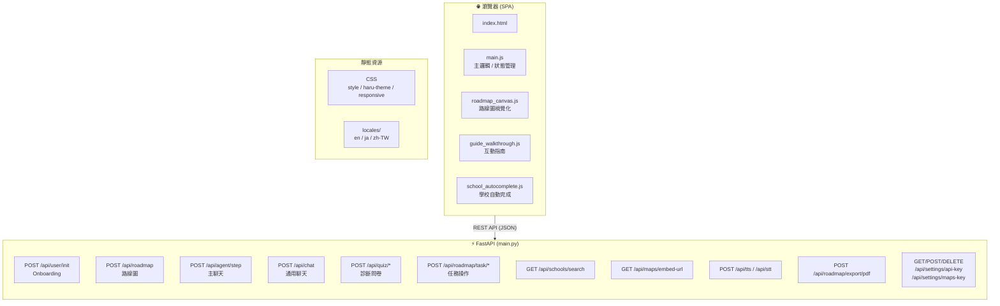
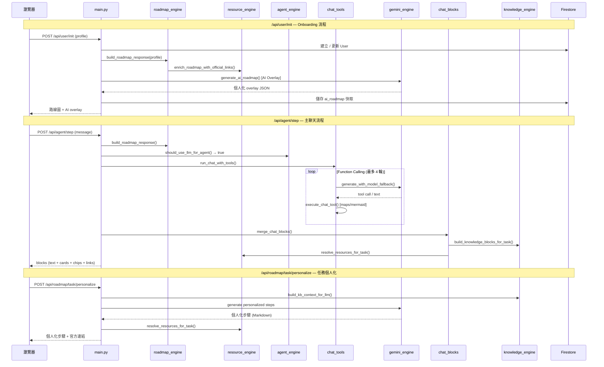
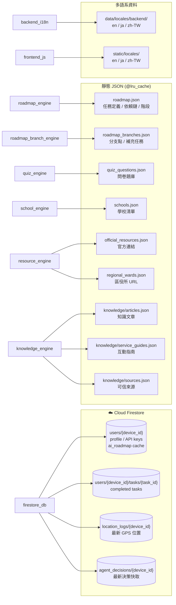
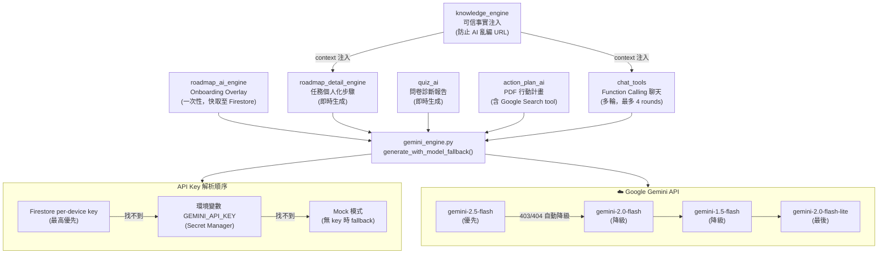
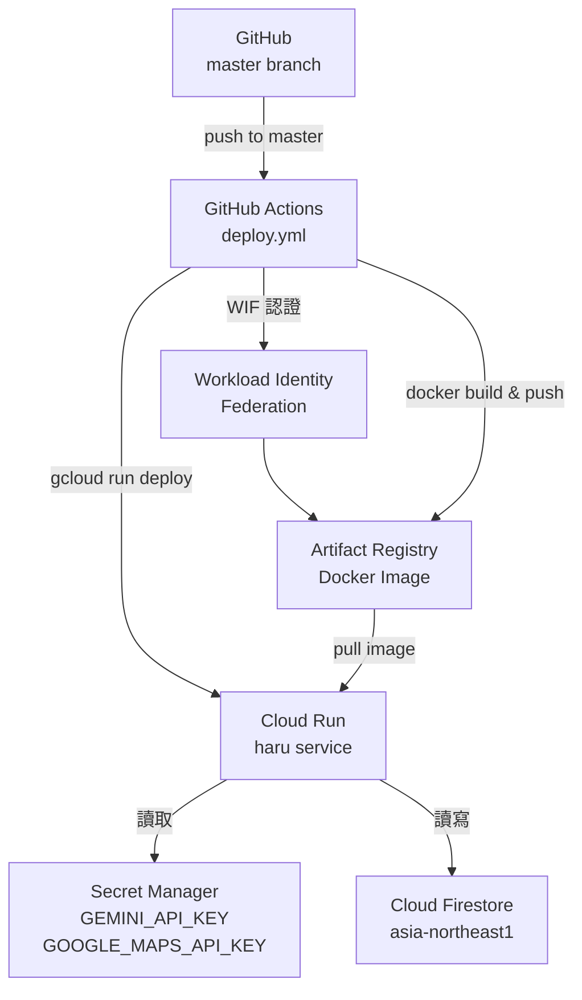

# HARU 系統架構圖

## 整體架構

```mermaid
graph TB
    subgraph Browser["🌐 瀏覽器 (SPA)"]
        HTML["index.html"]
        JS_Main["main.js<br/>主邏輯 / 狀態管理"]
        JS_Canvas["roadmap_canvas.js<br/>路線圖視覺化"]
        JS_Guide["guide_walkthrough.js<br/>互動指南"]
        JS_School["school_autocomplete.js<br/>學校自動完成"]
    end

    subgraph Static["靜態資源"]
        CSS["CSS<br/>style / haru-theme / responsive"]
        I18N_FE["locales/<br/>en / ja / zh-TW"]
    end

    subgraph FastAPI["⚡ FastAPI (main.py)"]
        direction TB
        API_Init["POST /api/user/init<br/>Onboarding"]
        API_Roadmap["POST /api/roadmap<br/>路線圖"]
        API_Agent["POST /api/agent/step<br/>主聊天"]
        API_Chat["POST /api/chat<br/>通用聊天"]
        API_Quiz["POST /api/quiz/*<br/>診斷問卷"]
        API_Task["POST /api/roadmap/task/*<br/>任務操作"]
        API_Schools["GET /api/schools/search"]
        API_Maps["GET /api/maps/embed-url"]
        API_TTS["POST /api/tts / /api/stt"]
        API_PDF["POST /api/roadmap/export/pdf"]
        API_Settings["GET/POST/DELETE<br/>/api/settings/api-key<br/>/api/settings/maps-key"]
    end

    Browser -->|"REST API (JSON)"| FastAPI
```

---

## 後端模組關係

```mermaid
graph TB
    subgraph Entry["入口層"]
        MAIN["main.py<br/>FastAPI 路由 & 啟動"]
    end

    subgraph Decision["決策層"]
        AGENT["agent_engine.py<br/>Rule-based / LLM 路由決策"]
    end

    subgraph AI["🤖 AI 層"]
        GEMINI["gemini_engine.py<br/>Gemini API 封裝<br/>Model Fallback"]
        ROADMAP_AI["roadmap_ai_engine.py<br/>Onboarding AI Overlay 生成"]
        DETAIL_AI["roadmap_detail_engine.py<br/>任務個人化步驟 Prompt"]
        QUIZ_AI["quiz_ai.py<br/>問卷診斷報告 AI"]
        ACTION_AI["action_plan_ai.py<br/>PDF 行動計畫 AI"]
        CHAT_TOOLS["chat_tools.py<br/>Gemini Function Calling"]
    end

    subgraph Roadmap["🗺️ 路線圖層"]
        ROADMAP["roadmap_engine.py<br/>路線圖核心邏輯<br/>任務狀態計算"]
        BRANCH["roadmap_branch_engine.py<br/>分支選擇 & 補充任務"]
        DETAIL["roadmap_detail_engine.py<br/>任務靜態展開"]
        GRAPH["roadmap_graph_engine.py<br/>Graph / Mermaid 資料"]
        MERMAID["roadmap_mermaid_engine.py<br/>Mermaid 圖表生成"]
        EXPORT["roadmap_export.py<br/>PDF 匯出"]
    end

    subgraph Knowledge["📚 知識層"]
        KNOWLEDGE["knowledge_engine.py<br/>知識庫查詢<br/>文章 / 指南 / 來源"]
        RESOURCE["resource_engine.py<br/>官方連結 DB<br/>區役所 URL 動態解析"]
    end

    subgraph Support["🔧 輔助層"]
        QUIZ["quiz_engine.py<br/>診斷問卷邏輯"]
        SCHOOL["school_engine.py<br/>學校 Fuzzy 搜尋"]
        MAPS["maps_engine.py<br/>Google Maps Embed URL"]
        CHAT_BLOCKS["chat_blocks.py<br/>聊天訊息區塊組裝"]
        I18N["backend_i18n.py<br/>後端多語系 t()"]
    end

    subgraph Data["💾 資料層"]
        FIRESTORE[("Firestore<br/>users / tasks<br/>location_logs / agent_decisions")]
        JSON_DATA["靜態 JSON 資料<br/>roadmap / branches / quiz<br/>schools / resources / wards<br/>knowledge articles & guides"]
        FIRESTORE_DB["firestore_db.py<br/>Firestore 存取層"]
    end

    MAIN --> AGENT
    MAIN --> ROADMAP
    MAIN --> QUIZ
    MAIN --> SCHOOL
    MAIN --> MAPS
    MAIN --> EXPORT
    AGENT --> CHAT_TOOLS
    CHAT_TOOLS --> GEMINI
    ROADMAP_AI --> GEMINI
    DETAIL_AI --> GEMINI
    QUIZ_AI --> GEMINI
    ACTION_AI --> GEMINI
    ROADMAP --> BRANCH
    ROADMAP --> GRAPH
    ROADMAP --> MERMAID
    DETAIL --> ROADMAP
    DETAIL --> BRANCH
    DETAIL --> DETAIL_AI
    EXPORT --> ACTION_AI
    DETAIL --> KNOWLEDGE
    DETAIL_AI --> KNOWLEDGE
    CHAT_TOOLS --> MAPS
    CHAT_TOOLS --> MERMAID
    CHAT_BLOCKS --> KNOWLEDGE
    CHAT_BLOCKS --> RESOURCE
    ROADMAP --> RESOURCE
    QUIZ --> QUIZ_AI
    MAIN --> CHAT_BLOCKS
    MAIN --> I18N
    FIRESTORE_DB --> FIRESTORE
    MAIN --> FIRESTORE_DB
    ROADMAP --> JSON_DATA
    BRANCH --> JSON_DATA
    KNOWLEDGE --> JSON_DATA
    RESOURCE --> JSON_DATA
    QUIZ --> JSON_DATA
    SCHOOL --> JSON_DATA
```

---

## 主要請求流程

```mermaid
sequenceDiagram
    participant Browser as 瀏覽器
    participant main as main.py
    participant roadmap as roadmap_engine
    participant resource as resource_engine
    participant agent as agent_engine
    participant chat as chat_tools
    participant gemini as gemini_engine
    participant blocks as chat_blocks
    participant knowledge as knowledge_engine
    participant db as Firestore

    Note over Browser,db: /api/user/init — Onboarding 流程

    Browser->>main: POST /api/user/init (profile)
    main->>db: 建立 / 更新 User
    main->>roadmap: build_roadmap_response(profile)
    roadmap->>resource: enrich_roadmap_with_official_links()
    main->>gemini: generate_ai_roadmap() [AI Overlay]
    gemini-->>main: 個人化 overlay JSON
    main->>db: 儲存 ai_roadmap 快取
    main-->>Browser: 路線圖 + AI overlay

    Note over Browser,db: /api/agent/step — 主聊天流程

    Browser->>main: POST /api/agent/step (message)
    main->>roadmap: build_roadmap_response()
    main->>agent: should_use_llm_for_agent() → true
    main->>chat: run_chat_with_tools()
    loop Function Calling (最多 4 輪)
        chat->>gemini: generate_with_model_fallback()
        gemini-->>chat: tool call / text
        chat->>chat: execute_chat_tool() [maps/mermaid]
    end
    main->>blocks: merge_chat_blocks()
    blocks->>knowledge: build_knowledge_blocks_for_task()
    blocks->>resource: resolve_resources_for_task()
    main-->>Browser: blocks (text + cards + chips + links)

    Note over Browser,db: /api/roadmap/task/personalize — 任務個人化

    Browser->>main: POST /api/roadmap/task/personalize
    main->>knowledge: build_kb_context_for_llm()
    main->>gemini: generate personalized steps
    gemini-->>main: 個人化步驟 (Markdown)
    main->>resource: resolve_resources_for_task()
    main-->>Browser: 個人化步驟 + 官方連結
```

---

## 資料層

```mermaid
graph LR
    subgraph Firestore["☁️ Cloud Firestore"]
        T1[("users/{device_id}<br/>profile / API keys<br/>ai_roadmap cache")]
        T2[("users/{device_id}/tasks/{task_id}<br/>completed tasks")]
        T3[("location_logs/{device_id}<br/>最新 GPS 位置")]
        T4[("agent_decisions/{device_id}<br/>最新決策快取")]
    end

    subgraph JSON["靜態 JSON (@lru_cache)"]
        J1["roadmap.json<br/>任務定義 / 依賴鏈 / 階段"]
        J2["roadmap_branches.json<br/>分支點 / 補充任務"]
        J3["quiz_questions.json<br/>問卷題庫"]
        J4["schools.json<br/>學校清單"]
        J5["official_resources.json<br/>官方連結"]
        J6["regional_wards.json<br/>區役所 URL"]
        J7["knowledge/articles.json<br/>知識文章"]
        J8["knowledge/service_guides.json<br/>互動指南"]
        J9["knowledge/sources.json<br/>可信來源"]
    end

    subgraph I18N["多語系資料"]
        L1["data/locales/backend/<br/>en / ja / zh-TW"]
        L2["static/locales/<br/>en / ja / zh-TW"]
    end

    firestore_db --> T1
    firestore_db --> T2
    firestore_db --> T3
    firestore_db --> T4
    roadmap_engine --> J1
    roadmap_branch_engine --> J2
    quiz_engine --> J3
    school_engine --> J4
    resource_engine --> J5
    resource_engine --> J6
    knowledge_engine --> J7
    knowledge_engine --> J8
    knowledge_engine --> J9
    backend_i18n --> L1
    frontend_js --> L2
```

---

## AI 層與 Gemini 關係

```mermaid
graph TB
    subgraph Gemini_API["☁️ Google Gemini API"]
        M1["gemini-2.5-flash<br/>(優先)"]
        M2["gemini-2.0-flash<br/>(降級)"]
        M3["gemini-1.5-flash<br/>(降級)"]
        M4["gemini-2.0-flash-lite<br/>(最後)"]
        M1 -->|"403/404 自動降級"| M2
        M2 --> M3
        M3 --> M4
    end

    subgraph Key_Resolution["API Key 解析順序"]
        K1["Firestore per-device key<br/>(最高優先)"]
        K2["環境變數 GEMINI_API_KEY<br/>(Secret Manager)"]
        K3["Mock 模式<br/>(無 key 時 fallback)"]
        K1 -->|"找不到"| K2
        K2 -->|"找不到"| K3
    end

    GEMINI_ENGINE["gemini_engine.py<br/>generate_with_model_fallback()"]
    GEMINI_ENGINE --> Key_Resolution
    GEMINI_ENGINE --> Gemini_API

    ROADMAP_AI["roadmap_ai_engine<br/>Onboarding Overlay<br/>(一次性，快取至 Firestore)"] --> GEMINI_ENGINE
    DETAIL_AI["roadmap_detail_engine<br/>任務個人化步驟<br/>(即時生成)"] --> GEMINI_ENGINE
    QUIZ_AI["quiz_ai<br/>問卷診斷報告<br/>(即時生成)"] --> GEMINI_ENGINE
    ACTION_AI["action_plan_ai<br/>PDF 行動計畫<br/>(含 Google Search tool)"] --> GEMINI_ENGINE
    CHAT_TOOLS["chat_tools<br/>Function Calling 聊天<br/>(多輪，最多 4 rounds)"] --> GEMINI_ENGINE
    KNOWLEDGE["knowledge_engine<br/>可信事實注入<br/>(防止 AI 亂編 URL)"] -->|"context 注入"| DETAIL_AI
    KNOWLEDGE -->|"context 注入"| CHAT_TOOLS
```

---

## Cloud Run 部署架構

```mermaid
graph TB
    GitHub["GitHub<br/>master branch"]
    GHA["GitHub Actions<br/>deploy.yml"]
    AR["Artifact Registry<br/>Docker Image"]
    CR["Cloud Run<br/>haru service"]
    FS["Cloud Firestore<br/>asia-northeast1"]
    SM["Secret Manager<br/>GEMINI_API_KEY<br/>GOOGLE_MAPS_API_KEY"]
    WIF["Workload Identity<br/>Federation"]

    GitHub -->|"push to master"| GHA
    GHA -->|"WIF 認證"| WIF
    WIF --> AR
    GHA -->|"docker build & push"| AR
    GHA -->|"gcloud run deploy"| CR
    CR -->|"讀取"| SM
    CR -->|"讀寫"| FS
    AR -->|"pull image"| CR
```
